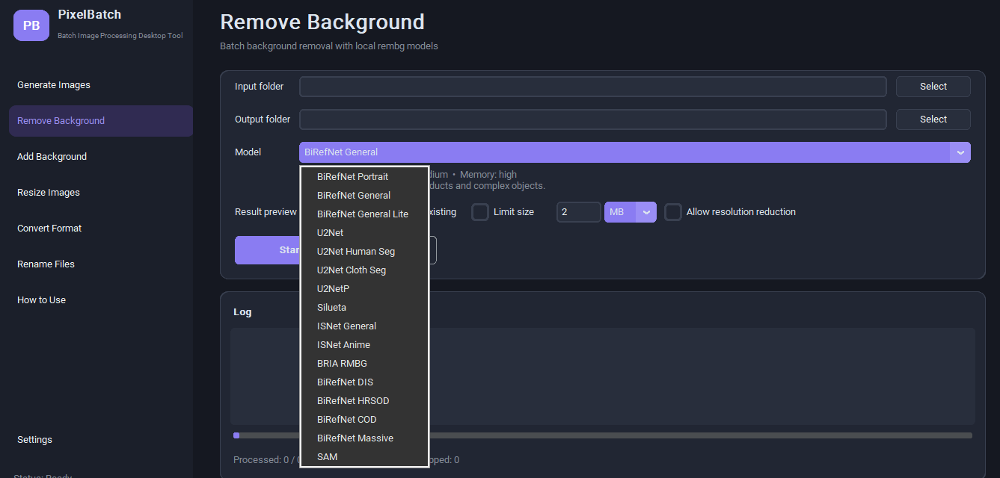
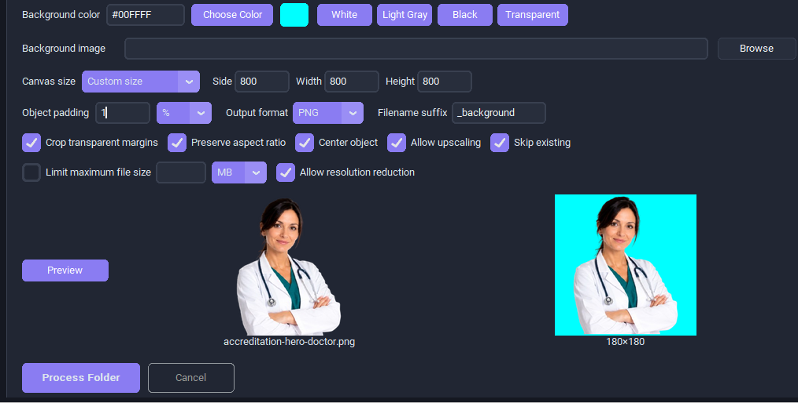

# PixelBatch

**Batch Image Processing Desktop Tool**  
**Инструмент для массовой обработки изображений**

Version: `0.1.0-alpha`

[**Download latest Windows release**](https://github.com/branchrelay/pixelbatch-desktop/releases/tag/v0.1.0-alpha)

> This project is currently in alpha development. Features and interfaces may change.

PixelBatch is a Windows desktop application for batch image processing. Its main purpose is background removal, resizing, format conversion, background and padding setup, mass file renaming, and preparation of images for e-commerce and content management.

## Features

- **Remove Background** — local batch background removal through rembg models.
- **Add Background** — solid color, transparent, or image background; canvas size; centering; padding.
- **Resize Images** — batch resize with fit/fill/exact/width-only/height-only/percentage modes.
- **Convert Format** — PNG, JPEG, WEBP, BMP, and TIFF conversion with alpha-safe JPEG compositing.
- **Rename Files** — mass renaming with prefix/suffix, remove text, find/replace, normalization, numbering, preview, copy mode, and guarded original rename mode.
- **Generate Images** — experimental AI image generation from CSV through a configured provider.
- RU/EN interface, light/dark/system themes, progress, cancel, logs with secret redaction.

The main app works without an API key. Local tools — background removal after model download, background addition, resizing, conversion, and renaming — do not require OpenRouter, OpenAI, Google, Alibaba, or any other image generation API key.

AI image generation is experimental. It requires a provider API key and should be treated separately from the local batch processing tools.

PixelBatch does not collect telemetry and does not use its own external servers. Prompts are sent only to the active AI provider when the experimental generation tool is used.

## Screenshots

### Remove Background



### Add Background preview



## Requirements

- Windows 10/11 x64;
- Python 3.11+ for development;
- internet access for AI providers and for the first rembg model download;
- optional provider API key only for experimental image generation.

## Install and run from source

```powershell
py -3.11 -m venv .venv
.\.venv\Scripts\Activate.ps1
python -m pip install --upgrade pip
python -m pip install -r requirements.txt
python app.py
```

Or:

```powershell
.\run.ps1
```

## Local data and secrets

API keys are stored through `keyring` in Windows Credential Manager when available. They are not written to `settings.json`.

Non-secret local app data is stored in:

```text
%APPDATA%\PixelBatch\
├── settings.json
├── logs\
├── cache\
└── temp\
```

If Windows Credential Manager is unavailable, PixelBatch offers a session-only API key mode. Logs redact registered API keys, Authorization, Cookie, `x-api-key`, and `x-goog-api-key` values.

Do not commit `.env`, `settings.json`, logs, user images, user CSV files, generated output, downloaded model weights, or built EXE files.

## Experimental AI providers

Open **Settings**, choose a provider, fill in Model, API Key, Base URL, Timeout, and Retries, then click **Save Settings**.

Default provider examples:

| Provider | Credential account | Default model | Default Base URL |
|---|---|---|---|
| OpenRouter | `provider_openrouter` | `openai/gpt-5-image-mini` | `https://openrouter.ai/api/v1` |
| OpenAI | `provider_openai` | `gpt-image-2` | `https://api.openai.com/v1` |
| Google | `provider_google` | `gemini-3.1-flash-image` | `https://generativelanguage.googleapis.com/v1` |
| Alibaba Cloud | `provider_alibaba` | `wan2.6-t2i` | `https://dashscope-us.aliyuncs.com/api/v1` |

Provider models, prices, endpoints, and permissions can change. Check the provider documentation before large generation jobs.

## CSV for experimental generation

CSV files must be UTF-8 or UTF-8 BOM and contain:

```csv
filename,prompt
product_001.png,"White ceramic cup, professional marketplace photo"
product_002.webp,"Minimalist black backpack, soft commercial lighting"
```

Unsafe Windows filename characters are normalized. Absolute paths and `../` cannot escape the selected output folder.

## Build one EXE

```powershell
.\build.ps1
```

Or directly:

```powershell
python -m PyInstaller --clean --noconfirm PixelBatch.spec
```

Result:

```text
dist\PixelBatch.exe
```

The spec includes CustomTkinter assets, Pillow plugins, rembg, ONNX Runtime, keyring backends, and request certificates. rembg model weights are intentionally not bundled.

## Tests

Tests use mocks and do not perform paid API requests:

```powershell
python -m pytest -q
```

If pytest cannot access the system temp folder on Windows, run it with `TMP` and `TEMP` pointing to a local ignored folder.

## Known alpha limitations

- The AI generation tool is experimental and depends on external provider availability.
- Cancel cannot safely interrupt an already-sent HTTP request; the response is discarded when it arrives.
- Exact PNG byte limits may be impossible without reducing resolution.
- First EXE launch can be slower because onefile PyInstaller unpacks to a temporary folder.
- First rembg use can be slower because the selected model may need to download.
- Original-file renaming has preview and conflict checks, but there is no full undo after successful rename.

## Contributing

Issues and focused pull requests are welcome. Before submitting a change, run:

```powershell
git status --short
python -m pytest -q
```

Keep `.env`, `settings.json`, `.venv/`, `build/`, `dist/`, logs, generated output, downloaded model weights, user data, and built `.exe` files out of commits.

## License

MIT License. Dependencies have their own licenses; review them before commercial redistribution of a built EXE.
